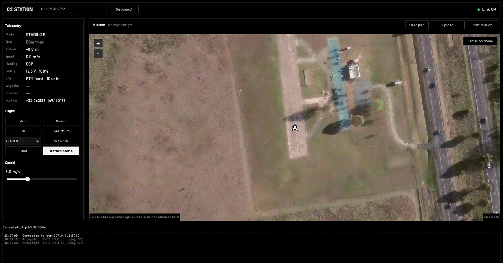
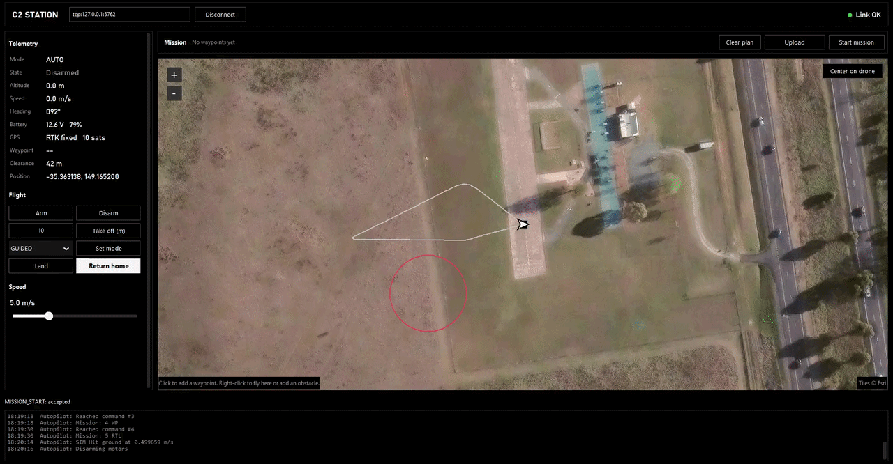
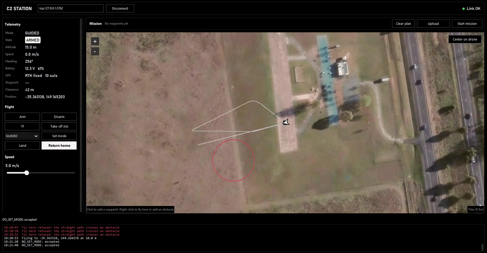
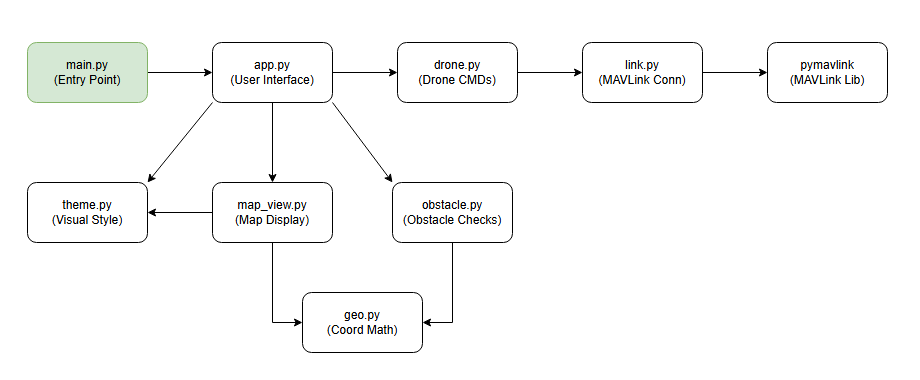

# C2 Station

A lightweight ground control station for ArduCopter, written in Python. Plan a mission on a satellite map, fly it, and change it mid-flight, all over MAVLink.



## Run it

1. Start ArduCopter SITL in Mission Planner (Simulation tab, Multirotor).
2. Install and run (Python 3.10+):
   ```
   pip install -r requirements.txt
   python main.py
   ```
3. Click Connect. The default `tcp:127.0.0.1:5762` works alongside Mission Planner.

> **Note:** With the default SITL parameters, the drone sometimes needed a bit of throttle input before it would fly, so I adjusted a few in Mission Planner. If you run into the same issue, load the parameters I used from `missionplanner/params10-2-2026.param` (Config, Full Parameter List, Load from file, then Write Params).

## Features

- **Missions:** click the map to add waypoints, then Upload and Start mission.
- **Mid-flight changes:** add waypoints and click Apply to flight, or right-click and Fly here.
- **Speed control:** a 1 to 15 m/s slider.
- **Obstacle detection:** right-click to add no-fly circles. Paths that cross one are refused, and the Clearance readout warns in flight.
- **Live UI:** telemetry, satellite map, and an event log.





## Architecture



Only `link.py` talks to MAVLink. A reader thread handles incoming telemetry, and a worker thread runs commands so the UI never freezes.

## Limitations

- Obstacles live only in the station, so RTL and autopilot failsafes can fly through them.
- Detection only, no automatic rerouting.
- The satellite map needs internet. Tested on SITL only.

## With more time

- Upload obstacles as ArduPilot fence zones for onboard avoidance.
- Drag and insert waypoints, and save and load missions.
- Test on real hardware.